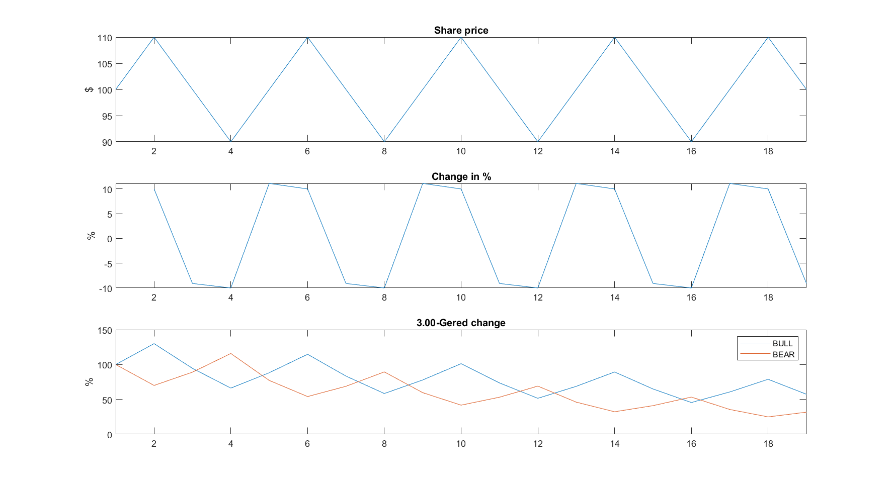

# Geared Stock Analysis #
##### Would you like to bet your money on a game where the house wins over time, statistically? Given a stock that rise and falls during the day, but at the end of the day its value has not changed. Would you have lost money on a BULL X3 or BEAR X3? If your believe the answer is no you are sadly mistaken. In either case you loose money. This is a game where the hose would win on both BULL and BEAR. #####
###### So, I was doing some math on geared BULL and BEAR stocks. Let's say you buy a BULL X3 stock. The main stock increases with 10%. Congratulations, you just earned 30%. Then the main stock drops by 9.09% going back to where it was. You just lost 27.27% and you end up with a total loss of 5.45% How could this be when the main stock got back to zero change? Well, since I lost on a BULL, I should have bought a BEAR then, they are inverted, right? Ever wondered about that? Well you and me both! ######

Let us say we have a stock, a BULL X3 and a BEAR X3. They all start out with the value of 100 pr. share at the beginning of a day. The main stock goes between 110 and 90 throughout the day, but when the market closes it is back at 100. How did it go with the BULL X3 and BEAR X3. Turn out, both of them are worth less than 100, and you have lost money, regardless. Behold:

When I learned this I finally understood why banks are so keen on customers buying BULL and BEAR stocks, this is just as a Casino, the house wins in the long run. Be enlightened, learn the math behind BULL and BEAR, and don't buy those products.

[Joachim Spange](https://www.linkedin.com/in/joachimspange/)