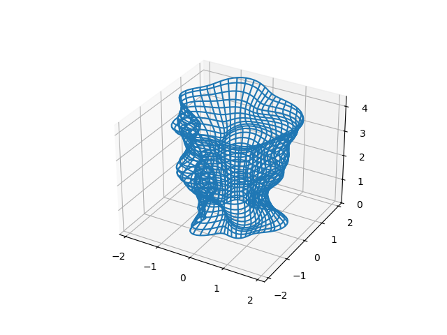

# Generating an STL File for 3D Printing in Python

In this documentation, I will demonstrate how to generate a 3D object. As an example, I'll create a bulgy/wavy flower vase that looks like this:


The corresponding matplotlib generated figure looks like this:



The output of this iPython Notebook is an STL file that can be imported into slicer software (e.g., FlashPrint) which slices it for your specific 3D printer.

## Steps for Creating the Vase

My steps for creating this vase were the following analogy:
1. Create a cone from $z = z_{min}$ to $z = z_{max}$ where $r = a * z + b$.
2. Add waves to the radius by making it dependent on both the angle and z, creating an irregular shape.

## Generating the Vase

To create the vase, follow these steps:

1. **Define Parameters:**
   - Set the minimum and maximum values for \( z \).
   - Define the coefficients \( A \) and \( B \) for the linear radius equation.
   - Define the wave parameters to create the irregular shape.

2. **Create the Cone:**
   - Generate a cone shape using the linear radius equation.

3. **Add Waves:**
   - Modify the radius to add waves based on the angle and \( z \) value.

4. **Generate Vertices and Faces:**
   - Use the marching cubes algorithm to generate vertices and faces.

5. **Create the STL File:**
   - Use the `mesh` module from `stl` to create the 3D object and save it as an STL file.

Here is a simplified version of the code to generate the vase:

```python
# Parameters
z_min, z_max = 0, 10
A, B = 0.1, 1
wave_amplitude, wave_frequency = 0.5, 2

# Generate the cone with waves
z = np.linspace(z_min, z_max, 500)
theta = np.linspace(0, 2 * np.pi, 500)
z, theta = np.meshgrid(z, theta)
r = A * z + B + wave_amplitude * np.sin(wave_frequency * theta) + wave_amplitude * np.cos(0.5 * wave_frequency * z)

# Convert to Cartesian coordinates
x = r * np.cos(theta)
y = r * np.sin(theta)

# Reshape x, y, and z to create a 3D volume
volume = np.stack((x, y, z), axis=-1)

# Use marching cubes to obtain the surface
vertices, faces, normals, values = measure.marching_cubes(volume, level=0)

# Create the mesh
vase_mesh = mesh.Mesh(np.zeros(faces.shape[0], dtype=mesh.Mesh.dtype))
for i, f in enumerate(faces):
    for j in range(3):
        vase_mesh.vectors[i][j] = vertices[f[j],:]

# Save as STL file
vase_mesh.save('vase.stl')
```

## Visualization

To visualize the generated vase, you can use matplotlib as follows:

```python
fig = plt.figure()
ax = fig.add_subplot(111, projection='3d')
ax.plot_surface(x, y, z, rstride=5, cstride=5, color='b', alpha=0.6, linewidth=0)
plt.show()

```

## Further Reading

To see different methods of generating the vase have a look at [vase.ipynb](vase.ipynb)  
The code in til README along with neccesarry imports is found at [Readme_code.ipynb](Readme_code.ipynb)  